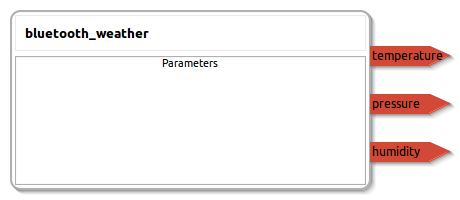

bluetooth_weather
====================

General description
---------------------
The bluetooth_weather package

Node: bluetooth_weather
---------------------
#### Parameters

#### Published Topics
**temperature** *(std_msgs::Float32)*   
<!--- protected region temperature on begin -->
<!--- protected region temperature end -->

**humidity** *(std_msgs::Float32)*   
<!--- protected region humidity on begin -->
<!--- protected region humidity end -->

**pressure** *(std_msgs::Float32)*   
<!--- protected region pressure on begin -->
<!--- protected region pressure end -->

#### Subscribed Topics

